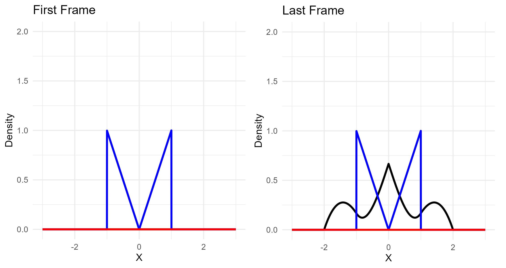
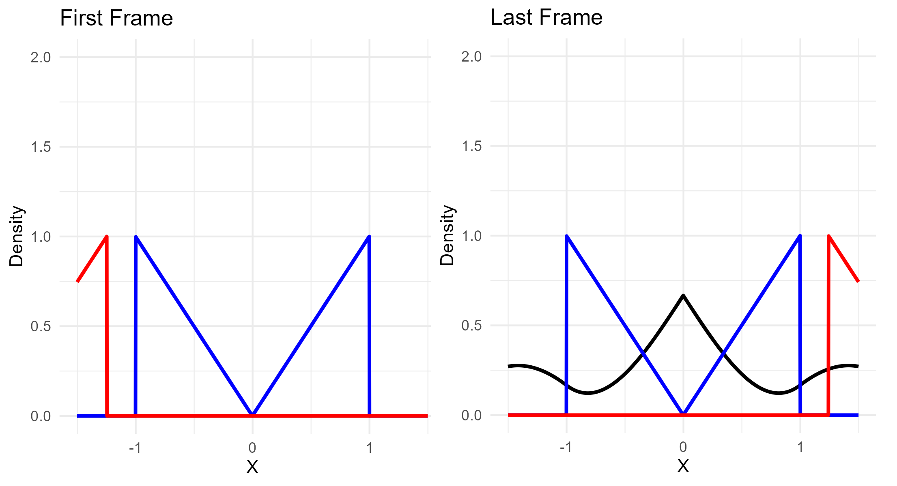

```{r setup, include=FALSE}
knitr::opts_chunk$set(echo = TRUE)
```

## Overview

This document serves as a tutorial to generating a .mp4 file using the functions in ConvolutionGenerator.

The functions are designed to create a visualization of the kernel, $g(\tau - t)$, "sweeping" across the input function, $f(t)$, with a live update of the convolution function $(f \ast g)(t)$.

The input function is assumed to be the density function of a random variable with mean zero, and $P(-b \leq X \leq b) = 1$ where $b$ is equal to the input bound.

The function is set up such that the kernel begins off-screen with a few frames of buffer, slides

## Generating Density Function

Convolution Generator has three built in functions for generating density functions that work well with the .mp4 generation function. It isn't necessary to use the provided functions, but if the user chooses to input their own function they will want to make sure they generated the function in a way that is compatible.

Our first step is creating a domain vector, which is defined over the desired plot interval. In this overview we will use the following domain:

```         
x <- seq(-3, 3, by = .002)
```

We will use the density function $f(x) = |x|$ for $x \in [-1,1]$ and $f(x) = 0$ $o.w.$. Using the absolute() function, we create an input vector of values of the function defined over our domain vector $x$ as such:

```         
func <- absolute(x, 1, -1, 1)
```

## Checking Frames

The generation of the .mp4 can take a while, so we may want to check that we have chosen an appropriate interval over which to define our function. We can use the first_frame() and last_frame() functions to ensure that we have given ourselves enough space:

```         
first_frame(func, -3, 3, step_size = .002)
last_frame(func, -3, 3, step_size = .002)
```

Note that the step_size input needs to be equal to the "by" parameter we used in the seq() function, and we use the same bounds

Our output .png files should appear as the following:



In this case everything appears good. The most likely issues we may observe arise from our choice in domain. If our domain is too large, then too much of the video will be wasted on the kernel approaching the function. If our domain is too small, then the kernel will start on-screen, which can make the video quite jarring and hard to follow. I will provide an example of the latter:

```         
x <- seq(-1.5, 1.5, by = .002)
func <- absolute(x, 1, -1, 1)

first_frame(func, -1.5, 1.5, step_size = .002)
last_frame(func, -1.5, 1.5, step_size = .002)
```



## Generating the .mp4

Once we believe that our input parameters are sufficient, we can generate the mp4. "input_function" dictates the function and kernel, "bound" dictates the radius of the x axis on the plot, and "by" represents the distance between each index in the domain. We will use the same bound and by as we used to generate our domain vector $x$.

The remaining parameters are more readily adjustable. "freq" indicates the number of indices in the function vector skipped between each plot, and increasing this value will reduce the total number of frames generated. "fps" dictates the framerate of the generated .mp4 file, and nIter indicates the number of convolutions to be generated.

The default for nIter is 1, but increasing this value will repeat the initial process of sweeping the kernel across a function, however the function from the previous iteration will be replaced by the computed convolution function. The process is illustrated below:
